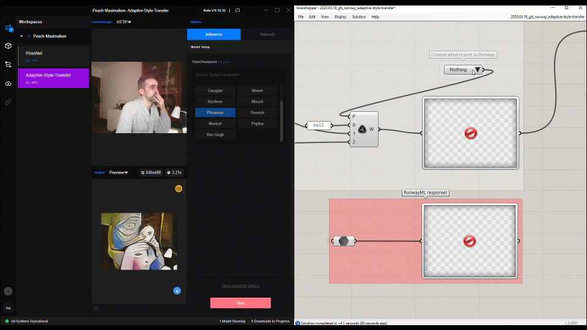

# grasshopper-runway-adaptive-style-transfer

Read comments in the code on how to run this experiment. 

This file contains a definition that takes live feed from a webcam, and requests a style transfer from RunwayML running Adaptive-Style-Transfer model. 

Requirements: check main repo `README.md`

Instructions:
- Open a new workspace, and add the Adaptive-Style-Transfer model to your workspace. 
- Run it (probably remotely, deploying it locally requires some additional setup).
- Open this definition. Make sure your webcam is not busy with any other process.
- Take a screenshot of the webcam using the camera icon on the FireFly screenshot component. 
- You should be ready to go! Now, simply "Choose what is sent to Runway" to request a prediction from the "Screenshot" (lightweight), or from the "Live Feed" (laggy).

Things should work as in the attached video files :)

The definition requires the FireFly plugin by Andy Payne, `jSwan` plug-in by Andrew Heumann and the `Data Tools` plug-in provided by the instructors. 

This file is part of a course workshop for https://www.gsd.harvard.edu/course/enactive-design-creative-applications-through-concurrent-human-machine-interaction-spring-2021/