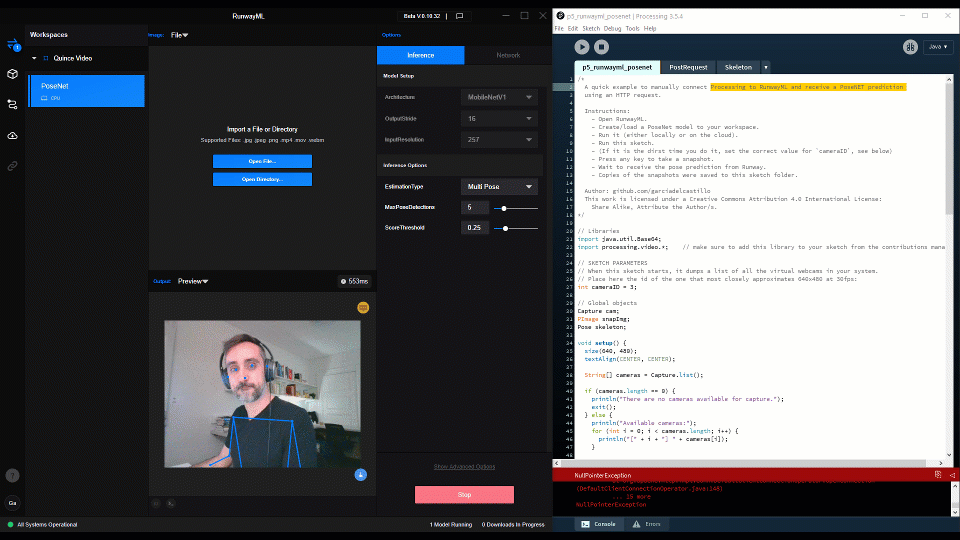

# p5-runway-posenet

Read comments in the code on how to run these sketches. 

A quick example to manually connect Processing to RunwayML and receive a PoseNET prediction using an HTTP request. 
  
Requirements: check main repo `README.md`

Instructions:
  - Open RunwayML.
  - Create/load a PoseNet model to your workspace.
  - Run it (either locally or on the cloud).
  - Run this sketch.
  - (If it is the dirst time you do it, set the correct value for `cameraID`, see below)
  - Press any key to take a snapshot.
  - Wait to receive the pose prediction from Runway. 
  - Copies of the snapshots were saved to this sketch folder. 

Things should work as in the attached video files :)

This file is part of a course workshop for https://www.gsd.harvard.edu/course/enactive-design-creative-applications-through-concurrent-human-machine-interaction-spring-2021/