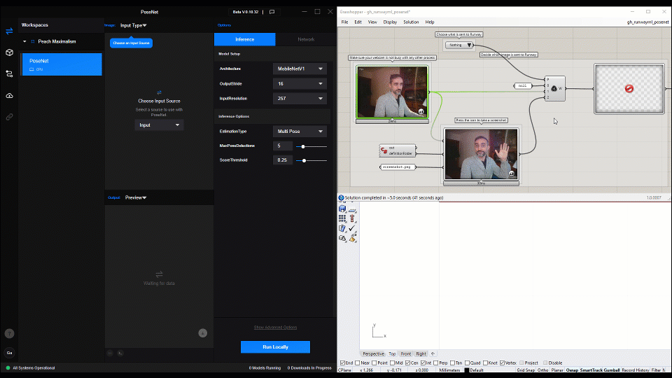

# runwayml-experiments
Just a collection of small experiments using RunwayML

### Requirements
Download and install RunwayML locally: https://runwayml.com/download (tested with Beta v.0.17.5)

For the Grasshopper samples:
- Rhino 7 or above. 
- Install the `jSwan` library: https://www.food4rhino.com/app/jswan. If it doesn't work, try the version in the `/libraries` folder. 
- Install the `Firefly 1.0.0.70`: https://www.food4rhino.com/app/firefly
- Go to the `Components` folder in Grasshopper, and replace all the `Firefly` files with the ones in `/libraries/Firefly_Updated_20210201.zip`. Make sure to unblock all the new files after unzipping. 
- Install the `Dynamic-Data-Tools` plug-in in `/libraries` 

For the Processing samples:
- Install the `Video` library from `Sketch > Import Library... > Add Library... > Video`.
- Install the `HTTP Requests for Processing` library (same as above).

### Tutorial

If you want to learn more about RunwayML and interoperability with Grasshopper and Processing, I taught an online workshop as part of my class [SCI-6365: Enactive Design, Creative Applications through Concurrent Human-Machine Interaction](https://www.gsd.harvard.edu/course/enactive-design-creative-applications-through-concurrent-human-machine-interaction-spring-2021/) Spring 2020 at the Harvard Graduate School of Design. Recording is [here](https://youtu.be/CDHmkUUf_1U).

### License

This work is licensed under a Creative Commons Attribution 4.0 International License: Share Alike, Attribute the Author/s.

[github.com/garciadelcastillo](https://github.com/garciadelcastillo)

[instagram.com/garciadelcastillo](https://www.instagram.com/garciadelcastillo/)

[twitter.com/garciadelcast](https://twitter.com/garciadelcast)
